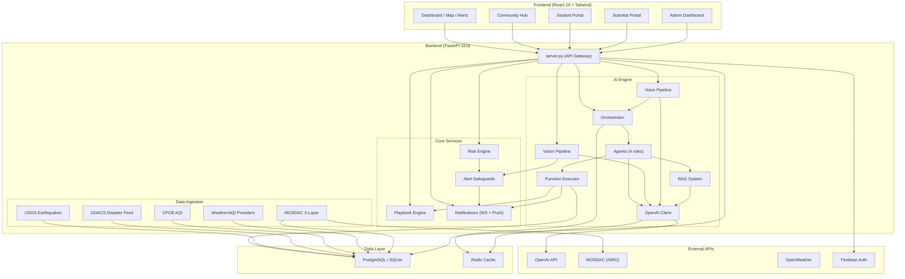
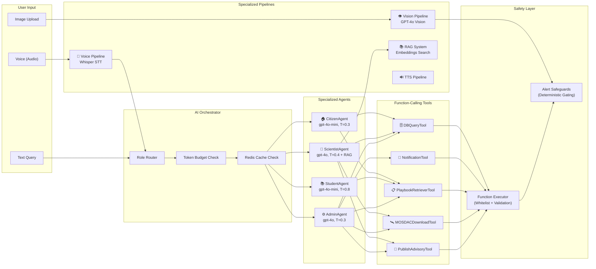

# 🛡️ Suraksha Setu — The Bridge of Safety

[](https://reactjs.org/)
[](https://fastapi.tiangolo.com/)
[](https://openai.com/)
[](https://python.org/)

**Suraksha Setu** is a production-ready, AI-powered disaster management platform providing early warnings, real-time alerts, community collaboration, and intelligent decision support for natural disaster preparedness and response across India.

---

## 🌟 Key Features

### 🗺️ Real-Time Monitoring & Alerts
- **Multi-source Data Ingestion** — USGS Earthquake, GDACS disaster feed, CPCB/OpenWeather AQI-weather, MOSDAC Satellite (3-layer)
- **Deterministic Risk Engine** — Rule-based tsunami, flood, cyclone, AQI hazard assessment
- **Alert Safeguards** — Threshold gating, confidence scoring, human-in-the-loop for medium-risk
- **One-Click Retraction** — False positive correction with SMS/push retraction messages
- **Interactive Map** — Leaflet-based geospatial visualization with live disaster overlays

### 🤖 AI-Powered Intelligence (OpenAI Integration)
- **4 Specialized AI Agents** — Citizen, Student, Scientist, Admin (role-based routing)
- **5 Function-Calling Tools** — DB Query, Notification, Playbook, MOSDAC Download, Advisory Publisher
- **Vision Pipeline** — GPT-4o image analysis for community-reported disaster photos
- **Voice Pipeline** — Whisper speech-to-text for voice queries (Hindi/English/regional)
- **RAG System** — Embedding-based semantic search for scientist research queries
- **Text-to-Speech** — Voice advisory generation for accessibility
- **Token Budget Management** — Redis counters + `ai_logs` table for cost control

### 👥 Community Hub
- **Disaster Reporting** — Citizen-submitted reports with photo/video evidence
- **Community Posts** — Social feed for information sharing during emergencies
- **Upvote/Downvote Verification** — Community-driven report validation
- **Nested Comments** — Discussion threads on posts and reports

### 🎓 Multi-Portal System
- **Citizen Portal** — Safety advisories, emergency contacts, playbook actions
- **Student Portal** — Educational disaster awareness with AI tutor
- **Scientist Portal** — Data analysis with RAG-powered research assistant
- **Admin Dashboard** — Alert management, retraction controls, AI usage monitoring

### 📱 Progressive Web App
- **Installable PWA** — Offline-capable with service worker
- **Push Notifications** — VAPID-based web push alerts
- **WebSocket Real-Time** — Live alert streaming without page refresh
- **Multi-Language** — English, Hindi, and regional language support

---

## 🏗️ System Architecture



---

## 🤖 AI Agent-Tools Architecture



---

## 🛠️ Tech Stack

| Layer | Technology |
|-------|-----------|
| **Frontend** | React 19, Tailwind CSS, Radix UI, React Router, Leaflet, Framer Motion |
| **Backend** | FastAPI 3.0, SQLAlchemy (Async), Pydantic v2 |
| **AI/ML** | OpenAI GPT-4o/4o-mini, Whisper, Vision, Embeddings (text-embedding-3-small), TTS |
| **Database** | PostgreSQL (prod) / SQLite (dev), Redis (caching + rate limiting) |
| **Auth** | JWT, Firebase Auth |
| **Data Sources** | USGS, GDACS, CPCB, ISRO MOSDAC, OpenWeather/Open-Meteo, IMD (where available) |
| **Notifications** | WebSocket, Web Push (VAPID), SMS (Twilio-ready) |
| **Deployment** | Render (Backend), Firebase Hosting (Frontend), Alembic (Migrations) |

---

## 📦 Quick Start

### Prerequisites
- **Python 3.11+** and **Node.js 16+**
- **Redis** (optional, for caching/rate-limiting)
- **FFmpeg** (optional, for voice pipeline audio normalization)

### Installation

```bash
# Clone
git clone https://github.com/samratmaurya1217/Project.git
cd suraksha-setu

# Backend
cd backend
python -m venv venv
.\venv\Scripts\activate        # Windows
# source venv/bin/activate     # Linux/Mac
pip install -r requirements.txt

# Frontend
cd ../frontend
npm install
```

### Configure Environment

Create `backend/.env`:
```env
# Database
DATABASE_URL=sqlite+aiosqlite:///suraksha_setu.db

# Redis (optional)
REDIS_URL=redis://localhost:6379/0

# API Keys
OPENAI_API_KEY=sk-your-key-here
OPENWEATHER_API_KEY=your_key_here

# OpenAI Models
OPENAI_MODEL_MINI=gpt-4o-mini
OPENAI_MODEL_HEAVY=gpt-4o
OPENAI_MAX_TOKENS_PER_REQUEST=1000
OPENAI_TOTAL_TOKEN_LIMIT=500000
OPENAI_EMBEDDING_MODEL=text-embedding-3-small

# Security
SECRET_KEY=your-secret-key
JWT_SECRET=your-jwt-secret

# MOSDAC (ISRO Satellite Data)
MOSDAC_USERNAME=your_username
MOSDAC_PASSWORD=your_password

# Push Notifications
VAPID_PUBLIC_KEY=your_vapid_public_key
VAPID_PRIVATE_KEY=your_vapid_private_key
VAPID_CLAIMS_EMAIL=your@email.com
```

### Run

```bash
# Backend (from backend/)
uvicorn server:app --reload --port 8000

# Frontend (from frontend/)
npm start
```

Visit `http://localhost:3000`

---

## 🔑 API Endpoints

### AI Endpoints
| Method | Endpoint | Description |
|--------|----------|-------------|
| `POST` | `/api/ai` | Unified AI chat (role-based routing) |
| `POST` | `/api/ai/chat` | Alias for AI chat |
| `POST` | `/api/ai/voice` | Voice query (audio → Whisper → AI) |
| `POST` | `/api/ai/vision` | Image analysis (GPT-4o Vision) |
| `POST` | `/api/ai/tts` | Text-to-Speech |

### Core Endpoints
| Method | Endpoint | Description |
|--------|----------|-------------|
| `GET` | `/api/alerts` | Get active disaster alerts |
| `GET` | `/api/playbook/actions` | Get SOP actions |
| `POST` | `/api/notifications/subscribe` | Push subscription |
| `POST` | `/api/notifications/broadcast` | Broadcast alert |
| `WS` | `/api/ws/{client_id}` | Real-time WebSocket |

### Admin Endpoints
| Method | Endpoint | Description |
|--------|----------|-------------|
| `GET` | `/admin/ai/usage` | Token usage & budget stats |
| `GET` | `/admin/ai/logs` | Recent AI call logs |
| `POST` | `/admin/alerts/retract` | One-click alert retraction |
| `POST` | `/admin/alerts/approve` | Approve pending alerts |

---

## 📱 Frontend Routes

| Route | Description |
|-------|-------------|
| `/` | Landing page |
| `/login` | Authentication |
| `/app/dashboard` | Main dashboard |
| `/app/map` | Interactive disaster map |
| `/app/alerts` | Alert system |
| `/app/weather` | Weather & AQI |
| `/app/disasters` | Disaster events |
| `/app/community` | Community Hub |
| `/app/student` | Student portal |
| `/app/scientist` | Scientist tools |
| `/app/admin` | Admin dashboard |

---

## 🗂️ Project Structure

```
suraksha-setu/
├── backend/
│   ├── server.py                    # FastAPI v3.0 (all routes)
│   ├── database.py                  # SQLAlchemy models (13 tables)
│   ├── risk_engine.py               # Deterministic hazard assessment
│   ├── playbook.py                  # SOP action lookup engine
│   ├── alert_safeguards.py          # Threshold gating + retraction
│   ├── notifications.py             # WebSocket + Push notification manager
│   ├── firebase_auth.py             # Firebase authentication
│   ├── mosdac_service.py            # MOSDAC satellite data service
│   ├── data_transformers.py         # Data transformation utilities
│   │
│   ├── ai/                          # 🤖 AI Engine
│   │   ├── openai_client.py         # OpenAI wrapper (Chat/Whisper/Vision/Embed/TTS)
│   │   ├── orchestrator.py          # Central AI router + tool-call loop
│   │   ├── agents.py                # 4 specialized agents (Citizen/Student/Scientist/Admin)
│   │   ├── tools.py                 # 5 function-calling tools with schemas
│   │   ├── function_executor.py     # Secure whitelist-based tool execution
│   │   ├── vision_pipeline.py       # Image analysis → severity classification
│   │   ├── voice_pipeline.py        # Audio → Whisper → AI response
│   │   ├── rag_system.py            # Embedding-based semantic search (RAG)
│   │   └── prompts.py               # System prompts for each agent
│   │
│   ├── ingest/                      # 📡 Data Ingestion
│   │   ├── manager.py               # Ingestion orchestrator
│   │   ├── usgs.py                  # USGS earthquake data
│   │   ├── cpcb.py                  # CPCB air quality data
│   │   ├── mosdac_metadata.py       # MOSDAC Layer 1 (metadata polling)
│   │   └── mosdac_downloader.py     # MOSDAC Layers 2+3 (event/region download)
│   │
│   ├── routes/
│   │   └── admin.py                 # Admin retraction/approval API
│   │
│   ├── utils/
│   │   ├── redis_client.py          # Redis connection manager
│   │   └── geo.py                   # Haversine + PostGIS utilities
│   │
│   ├── data/
│   │   └── playbook.json            # Disaster SOP action rules
│   │
│   ├── tests/                       # Test suite
│   ├── alembic/                     # Database migrations
│   ├── requirements.txt             # Python dependencies
│   └── .env                         # Environment variables
│
├── frontend/
│   ├── src/
│   │   ├── components/              # 80+ React components
│   │   ├── pages/                   # 16 page components
│   │   ├── contexts/                # Auth + Location contexts
│   │   ├── hooks/                   # WebSocket, Toast hooks
│   │   ├── services/                # API service layer
│   │   ├── config/                  # Firebase config
│   │   └── i18n.js                  # Internationalization
│   ├── public/
│   │   ├── service-worker.js        # PWA service worker
│   │   └── manifest.json            # PWA manifest
│   └── package.json
│
├── AGENTS.md                        # Agent verification rules
└── README.md                        # This file
```

---

## 🧪 Testing

```bash
# Backend unit tests
cd backend
pytest tests/ -v

# Frontend tests
cd frontend
npm test
```

---

## 🔐 Security

- ✅ API keys stored in `.env` (never exposed to frontend)
- ✅ JWT authentication on protected endpoints
- ✅ Role-based access control (Citizen/Student/Scientist/Admin)
- ✅ Function-call whitelist (prevents unauthorized tool execution)
- ✅ Input validation and sanitization
- ✅ Redis-based rate limiting per endpoint
- ✅ Token budget enforcement with hard limits
- ✅ CORS configuration for production origins

---

## 🤝 Contributing

1. Fork the repository
2. Create a feature branch (`git checkout -b feature/xyz`)
3. Follow code standards (ESLint for frontend, PEP 8 for backend)
4. Submit a pull request

## 📝 License

MIT License — see LICENSE file for details.

## 👥 Team

- **Samrat Maurya** — AI Architect, Project Lead
- **Gaurav Rajbhar** — Backend Developer
- **Harsh Niket** — Frontend Developer

## 🔗 Links

- **GitHub**: [Suraksha Setu](https://github.com/samratmaurya1217/Project)
- **Live Demo**: [suraksha-setu-hls5.onrender.com](https://suraksha-setu-hls5.onrender.com)

---

**Suraksha Setu** — Building a safer tomorrow, today. 🛡️
